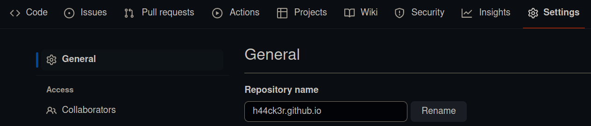
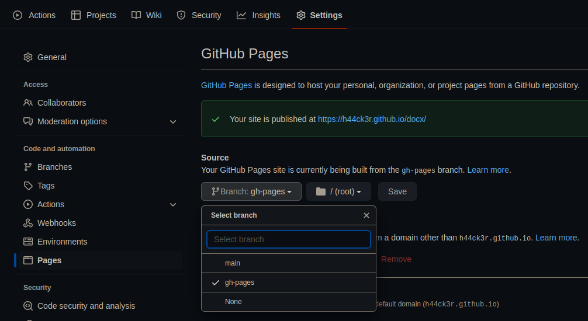

Premierement nous devons changer le nom du projet pour que quelque chose comme ca bash`<GHusername>.gihub.io` il est possible de donner une autre nom a votre projet mais le projet seras considérer comme un dossire du page principale. donc l'url resembleras a ceci `<GHusername>.gihub.io/<repo name>` c'est donc une qestion de preférence.     

Pour ma part je prefere avoir un 'dossier' donc je ne vais pas faire cette etape et si vous etes comme moi vous pouvez directement passer a la suite.

Si vous voulez avoir un URL directe il faut changer le nom de votre repo.    
Il faut aller dans settings > General > Repository name vous changer le nom pour que ca resemble a ca : `<GHusername>.gihub.io` pensez a cliquer sur le bouton 'Rename'.

{: .normal}        
_changer le nom du projet_

### Branche de publication 
Deuxiément on doit choisir quelle est le source de site, pour choisir cela on va dans settings > pages > Source  et dans les branche assurez vous de choisir gh-pages vous pouvez sauvegarder et tout est bon.

{: .normal}       
_choisir la brance de publication_

> Ici vous aurez egalement L'URL Github de votre blog.
{: .prompt-tip }

c'est tout ce que nous avons a faire maintenant le secript va tout faire nous faire.


### Les commandes git
Maintenant il suffit de syncroniser les modifications local avec github.

> vous pouvez faire un ```bash
JEKYLL_ENV=production bundle exec jekyll b``` avant de faire le push ainsi la version produ de notre site seras egalement backup sur github.
{: .prompt-tip }

```bash
git add .
git commit -m '<un commentaire qui decrit ce comit>'
git push
```
une fois que la commande push est passé vous verrez dans l'onglet action, Github-actions bot construire votre page., une fois qu'il a fini, vous verrez le blog en ligne.

et voilà votre site est en ligne.