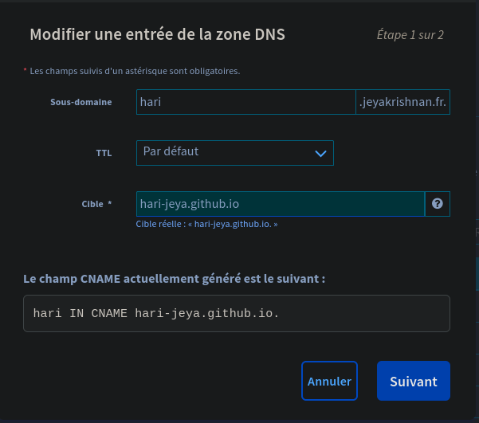
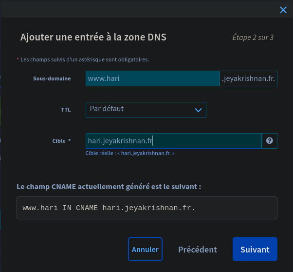

ajouter les cname dans ovh
modifier github

Git hub nous permet d'heberger un projet public enligne et d'avoir accée avec un URL github.io.     
Il est toute fois possible ne pas utiliser le nom domaine github.io et a la place avoir un nom de domaine personalaiser.

pour ca il suffit d'avoir un nom de domaine et c'est tout.

## Nom de domaine
---
Pour avoir votre demaine il faut faire l'achat au pres d'un hebergeur comme OVH, Go daddy ou inonnos ou n'importe quelle hebergeur.
l'aquisition d'un nom de domaine n'est pas tres honnereux.      
> vous pouvez même trouver des nom de domaine gratuit si vos etes pas trop regatdant sur l'extension.
{: .prompt-tip }

Pour ma part j'ai des nom de domaien chez OVH et Chez Ionos ce sont deux hebergeur que je peux recommander mais vraiment toute les hebergeur se vallent si c'est juste pour l'achat d'un nom de domaine.

## GitHub hebergemet
---
Avec Git-hub vous avez trois choix d'hebergement soit repo dans ce cas la l'URL du projet deverais resembler a ceci `<gh username.github.io/<repo name>`.    
ou soit un seul enregistrement qui serais relier a votre nom d'utilisateur, on fait ce choix lorsqu'on est sur que nous auras pas a heberger d'autre projet.      
ou alors vous combinez les deux; un repo principal sur `<gh username.github.io` et un autre projet sur `<gh username.github.io/<repo name>`.

Il vous faut savoir dans quelle situation vous etes.   
> il est toujours possible de faire changer vos choix d'hebergement sur github.
{: .prompt-info }

## Entregistrement DNS
---
Il n'est pas possible de configuer des site en sous dossier sur github.     
> Si vous souhaitez un Url unique pout votre site projet je vous conseille de créer un sous domaine pour le projet.
{: prompt-tip}

Pour ma part j'ai le nom de domaine `jeyakrishnan.fr` chez OVH donc c"est avec leur interface que je vous montre le process mais il deverais etre quasient le meme pour tout les hebergeur juste des visuel différents.

Vous pouvez configuer un sous domaine pour qu'il pointe directement vers un URL [Gitgub](https://google.fr) mais il est vivement conseiller de configurer le sous domaine vers L'url de votre projet.

Il y a plusieur type d'enregistrement dans la zone DNS mais etant donnée que nous allons faire une redirection vers un autre URL il est judicieux d'utiliser le champs `CNAME`

ici je créer le sous domaine **hari.jeyakrishnan.fr** pour mon projet de documentation.       
{: .normal}    
_Sous domaine pour le projet_

C'est aussi conseiller de créer un sous sous domaine **WWW** autrement lorsque les utilisateur chercheron `www.<sub.domaine.ext>` la recherche rique de ne pas aboutir.    

> Je vous conseille de faire pointer le WWW sur **votre** sous domaine ainsi lorsque vous souhaiterez changer la destination du sous domaine il suffit de faire la moifiacation uen seul fois.
{: prompt-tip}

{: . normal}
_World Wide Web sub domaine for our subdomaine._

> Les modification dans la zone DNS peuveent mettre jusqu'a 48h pour se propager partout dans le monde.
{: .prompt-info }
## condifiguration github
---
Maintenant que nous avons notre enregistrement DNS en attendant qu'il se propage partout nous pouvons finir la configuration sur Github